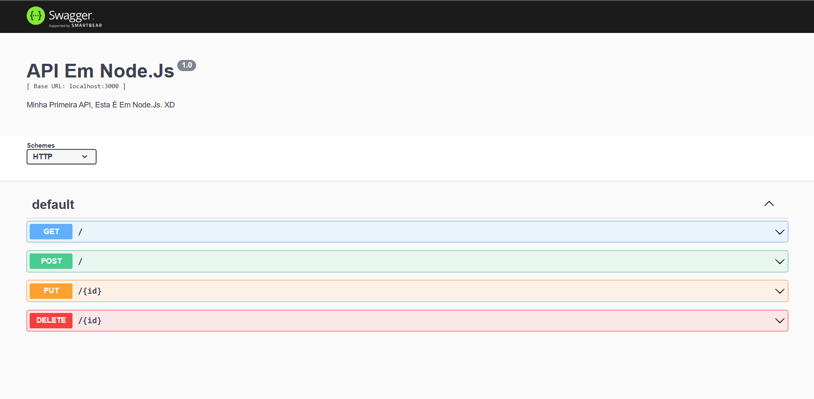

# APInodeTrue

Esta é minha primeira API, esta em específico é em Node.Js.

Fiz ela com a orientação do [Professor Fabio Longo de Moura](https://github.com/ldmfabio).

E também com o auxilio de um video para a API emsi e um site para a documentação.
* Video: [Operações de CRUD em arquivo JSON usando JavaScript](https://www.youtube.com/watch?v=M7uMuGIlA98).
* Site:[Como automatizar documentação de APIs REST em Node.js com Swagger?](https://www.letscode.com.br/blog/como-automatizar-documentacao-de-apis-rest-em-nodejs-com-swagger).

Para utilizar a API é muito simples, basta clonar este repositório em seu computador e abrir um terminal ou um cmd, é muito importante que você abra a pasta que contém a API para funcionar.
Caso você clone pelo Visual Studio Code basta abrir um terminal pelo próprio VS e digitar:
```
>npm init -y
```
E em seguida digitar:
```
>npm start
```

Ou também funciona colocar:

```
>npm init -y
```
E em seguida digitar:
```
>npm run dev
```

E em seguida no seu navegador digite na url : "localhost:3000/docs". 
E pronto, você conseguirá utilizar a API.
Esta API conta com 4 Metodos, o "Get", "Post", "Put" e "Delete".

No "Get" você consegue conferir quais dados estão registrados na API, e consegue obter todos os campos de cada um, nome, idade, cidade entre outros, e também o mais importante de cada um para a API, o ID de cada um, que é essencial para o "Put" e o "Delete".

No "Post" como o próprio nome sugere te possibilita colocar dados na API.

No "Put" que seria "Update" te possibilita modificar dados já presentes na API, neste caso é necessário o ID de quem se deseja mudar os dados.

E por fim temos o "Delete", que através do ID de alguém em específico exclui os dados da API, basta selecionar o ID e executar que os dados serão excluidos.


# <u>API Funcionando (◠‿◠)</u>
